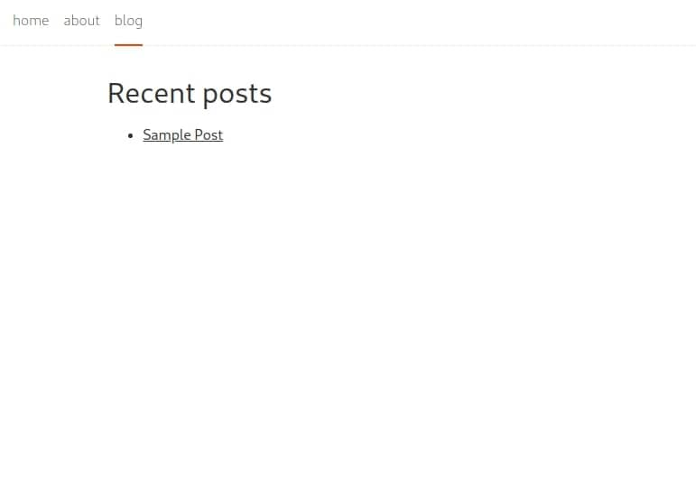
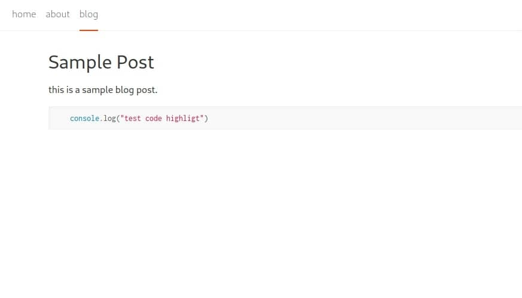

# Building a blog with Svelte, Sapper, and Markdown

In this post, we will build a website with a blog using svelte, and sapper.

## What is Svelte?

Svelte is a new javascript framework come on the table,
Svelte has a philosophy that helps you manipulate the DOM without using any additional techniques like virtual DOM,
Svelte compile your code on the build time, and you can update your app easily using reactivity.

## What is Sapper?

Sapper is a Server Side framework on top of Svelte helps you create PWA apps with a good SEO and file system based routing.

## How to init the project?

We are going to use the starter template provided by the Sapper team,
open your favorite terminal and write the following command:

```bash
  npx degit "sveltejs/sapper-template#rollup" cool-blog
  cd /cool-blog
  npm install
```

After installing the dependencies, you should be good to go and start your server.

```bash
  npm run dev
```

Voila, 🎉 the application now up and running.


Let's open the project in your favorite editor. and go to the `blog` folder
inside the `src/routes`.

We have several files there:

```bash
  | src
    | routes
      | blog
        - index.svelte,
        - index.json.js
        - [slug].svelte
        - [slug].json.js
        - _posts.js
```

## How routing works in sapper?

we have two types the pages, and server routes.

### Pages

The filename detrmine the route. For example: `src/routes/blog/index.svelte` refer to the route `/blog`.

For Dynamin routing. we going to use `[slug]`. For example `ser/routes/blog/[slug].svelte` refer to route `/blog/the-whatever-blog-name`

### Server

Server routes are modules written in `.js` files that export HTTP functions.
For example `get` endpoint to retrieve the blog details:

```javascript
  // [slug].json.js

  import posts from './_posts.js';
  const lookup = new Map();

  posts.forEach(post => {
    lookup.set(post.slug, JSON.stringify(post));
  });

  export function get(req, res, next) {
    // the `slug` parameter is available because
    // this file is called [slug].json.js
    const { slug } = req.params;

    if (lookup.has(slug)) {
      res.writeHead(200, {
        'Content-Type': 'application/json',
      });

      res.end(lookup.get(slug));
    } else {
      res.writeHead(404, {
        'Content-Type': 'application/json',
      });

      res.end(
        JSON.stringify({
          message: `Not found`,
        })
      );
    }
  }
```

Create a `content` directory on the root of your project.
inside this directory, we going to create a file called `sample-post.md` file.

```markdown
// sample-blog.md
// remove comments in case you copy and paste this file for test to make it work

---
slug: 'sample-blog'
title: 'Sample blog.'
---

# Sample title

this is a sample blog post.

// add extra \` to make it work(this blog use same method so tripple \` would be shown as a code here)
``javascript
  console.log("test code highlight")
``

```

`slug` has to be the same as the file name, So we can easily read the file with the slug.
You can add more than `title`, and `slug`, For Example, Date, keywords or whatever you need to add.


To list all blogs on `/blog` route open `src/routes/blog/index.json.js`

```javascript
  // src/routes/blog/index.json.js

  import fs from "fs";
  import path from "path";
  import grayMatter from "gray-matter";

  const getAllPosts = () =>
    fs.readdirSync("content").map(fileName => {
      const post = fs.readFileSync(path.resolve("content", fileName), "utf-8");
      return grayMatter(post).data;
    });

  export function get(req, res) {
    res.writeHead(200, {
      "Content-Type": "application/json"
    });
    const posts = getAllPosts();
    res.end(JSON.stringify(posts));
  }
```

You need to install an extra package called `gray-matter` that helps you parse the front matter data `title`, and `slug` from
the markdown.

```bash
  npm install gray-matter
```

If you navigate to `/blog` route you should have a page similar to this:



Now we need to handle the post route. open `src/routes/blog/[slug].json.js`

```javascript
  // src/routes/blog/[slug].json.js

  import path from "path";
  import fs from "fs";
  import grayMatter from "gray-matter";
  import marked from "marked";
  import hljs from "highlight.js";

  const getPost = fileName =>
    fs.readFileSync(path.resolve("content", `${fileName}.md`), "utf-8");

  export function get(req, res, next) {
    const { slug } = req.params;

    // get the markdown text
    const post = getPost(slug);

    // function that expose helpful callbacks
    // to manipulate the data before convert it into html
    const renderer = new marked.Renderer();
./
    // use hljs to highlight our blocks codes
    renderer.code = (source, lang) => {
      const { value: highlighted } = hljs.highlight(lang, source);
      return `<pre class='language-javascriptreact'><code>${highlighted}</code></pre>`;
    };

    // parse the md to get front matter
    // and the content without escaping characters
    const { data, content } = grayMatter(post);

    const html = marked(content, { renderer });

    if (html) {
      res.writeHead(200, {
        "Content-Type": "application/json"
      });

      res.end(JSON.stringify({ html, ...data }));
    } else {
      res.writeHead(404, {
        "Content-Type": "application/json"
      });

      res.end(
        JSON.stringify({
          message: `Not found`
        })
      );
    }
  }
```

Two new packages we need to install
- marked: help us to convert the markdown file into HTML.
- highlight.js: add highlights to the code blocks.

```bash
  npm install highlight.js marked
```

In `src/client.js` we import Github styles for highlight.js.

```javascript
  // src/client.js
  // ...
  import "highlight.js/styles/github.css";
  // ...
```



## conclusion 

You now ready to go and add more styles for your website and customize the blog elements styles.
to go live using [Netlify](http://netlify.com/), [Github Page](https://pages.github.com/) or any service.


