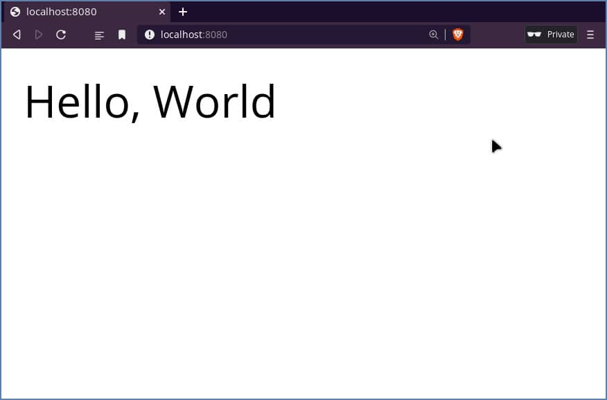
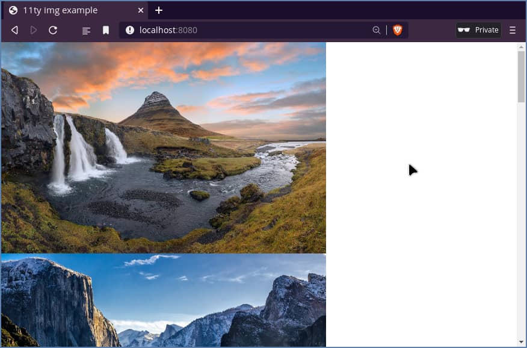
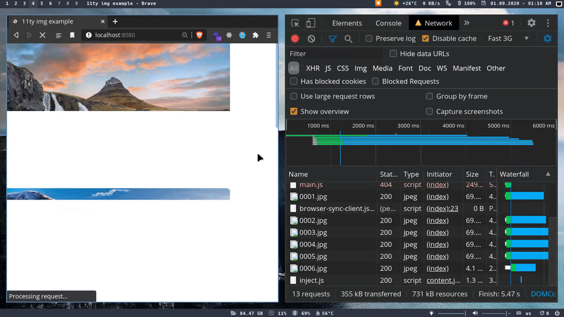

# How to optimize and lazy-loading images on eleventy (11ty)

Building a site that has images requires to optimize them 
to avoid any content shifting and deliver a good user experience.

To achieve that you have to compress, resize, and convert formats for your images. 

In this article we will take a look for how to automate your images in eleventy 
static site generated website using [eleventy-img](https://github.com/11ty/eleventy-img/), and [sharp](https://github.com/lovell/sharp).

## Create a basic project to start

create a new directory and name it `11ty-img-example` or whatever you want,
then run 

```bash
yarn init -y
```
you can use `npm` if you prefer. 

now install `eleventy`, and create index.njk
on the root with basic `html` markup.

```bash
yarn add -D @11ty/eleventy
touch index.njk
```
```html
<!-- index.njk -->

<!DOCTYPE html>
<html lang="en">
  <head>
    <meta charset="UTF-8" />
    <meta name="viewport" content="width=device-width, initial-scale=1.0" />
    <title>11ty img example</title>
  </head>
  <body>
    Hello, World!
  </body>
</html>
```

open your `package.json` file and add dev and build scripts:

```json
// package.json

"scripts": {
  "dev": "eleventy --serve",
  "build": "eleventy"
}
```

## run the project on your browser

open your favorite terminal and run 

```bash
yarn dev
```
now open `localhost:8080` on your browser and
it should work without any customized eleventy configuration.



## Display some images

let's try get some images and place them in `images` directory.
and inside `index.njk` try to display theme.


```bash
ls images/

518k   0001.jpeg
2.6M   0002.jpeg
1.7M   0003.jpeg
368k   0004.jpeg
679k   0005.jpeg
556k   0006.jpeg
602k   0007.jpeg
1.6M   0008.jpeg
1.4M   0009.jpeg
```

```html
<!-- index.njk -->
<body>
  
  
  <!-- ... -->
</body>
```
open your browser and it shouldn't render any image.
yeah that's right 😀 because `eleventy` doesn't handle 
assets like css, js, or images so we need to configure that
by ourself.

create a `.eleventy.js` file on the root directory,
then write: 

```js
module.exports = (cfg) => {
  cfg.addPassthroughCopy("images");
}
```
now everything inside `images` directory 
will be copied to the build directory.

Restart your server and go back to your browser
and it should everything work.



## Test images performance without optimization

Let's see how images doing before any optimization.

Open network tab  inside the devtool and set `fast 3G` as network simulation.

in my case it took `50s` to render all images, and some of these 
images have size more than `2mb`. so we need to find a way 
to make it faster.



## Add `eleventy-img` plugin

it's the time to use the `eleventy-img`, this plugin from 
eleventy team you can find the repo from [here](https://github.com/11ty/eleventy-img/).

Install it in our project.

```bash
yarn add -D @11ty/eleventy-img
```

open `.eleventy.js` file and remove the line that we wrote before, then add the code below:

```js
// .eleventy.js

const Image = require("@11ty/eleventy-img");

module.exports = (cfg) => {
  cfg.addNunjucksAsyncShortcode("Image", async (src, alt) => {
    if (!alt) {
      throw new Error(`Missing \`alt\` on myImage from: ${src}`);
    }

    let stats = await Image(src, {
      widths: [25, 320, 640, 960, 1200, 1800, 2400],
      formats: ["jpeg", "webp"],
      urlPath: "/images/",
      outputDir: "./_site/images/",
    });

    let lowestSrc = stats["jpeg"][0];

    const srcset = Object.keys(stats).reduce(
      (acc, format) => ({
        ...acc,
        [format]: stats[format].reduce(
          (_acc, curr) => `${_acc} ${curr.srcset} ,`,
          ""
        ),
      }),
      {}
    );

    const source = `<source type="image/webp" srcset="${srcset["webp"]}" >`;

    const img = ``;

    return `<div class="image-wrapper"><picture> ${source} ${img} </picture></div>`;
  });
}
```

Let's break down the code and understand how it works

- `addNunjucksAsyncShortcode`

eleventy has feature called `shortcodes` let 
you extend your template engine by writing custom functions.

in our case we will have a new shortcode we can use inside our templates by 
writing:

```html

```

- `stats = new Image(...)` 

we pass the src url, formats, and various widths to the image plugin. 

So we well have multiple sizes, and formats for each image.

- `const srcset = ...`

the `stats` result look like that
```js
stats = {
  jpeg: [
    {
      url: '...',
      src: '...',
      srcset: '...'
    }
  ],
  webp: [
    ...
  ]
}
```

We need to covert every size srcset to only one srcset string by using `reduce` function, So
we can inject it in our code.

so the result of variable `srcset`
```js
srcset = {
  jpeg: '<srcset>'
  webp: '<srcset>'
}
```

- `const source = ...` and `const img = ...`

Use `webp` format for `source` as main image type and `jpeg` as fallback fro `img` tag.

Now we are good to go by return the whole `picture`.


## Test Images after using `eleventy-img`

open `index.njk` and replace all `img` tags with

```html
<!-- index.njk -->

<!-- ... -->




<!-- ... -->
```
> **PS:** you have to write image paths include the full path from the root of the project to make it works.

Restart your server and go to the browser. and again open network tab.

and Boom 💥 in this time all images loaded on `5s` and no image
has size more than `120kb`.


## Add lazy-loading and the blurry effect

this is an extra step to avoid content shifting by using
inline `base64` image as placeholder for images and use
javascript as fallback for browser that not supported yet
the native lazyloading with [vanilla-lazyload](https://github.com/verlok/vanilla-lazyload).

install sharp package to get the blurry inline base64 image 

```bash
yarn add -D sharp
```

on `.eleventy.js` import sharp package and add this code below:

```js
// .eleventy.js

const sharp = require('sharp');

// ...

const placeholder = await sharp(lowestSrc.outputPath)
  .resize({ fit: sharp.fit.inside })
  .blur()
  .toBuffer();

const base64Placeholder = `data:image/png;base64,${placeholder.toString(
  "base64"
)}`;

// ...
```

And then replace `src`, `srcset`, and `resize`, to `data-src`, `data-srcset`, and `data-resize`.

And also add `src` attribute in `` tag to `src="${base64Placeholder}"`.


The final code after changes:

```js
const source = `<source type="image/webp" data-srcset="${srcset["webp"]}" >`;

const img = ``;
```

And as mentioned before in this article that eleventy only handles html 
template engines, So we will use `script` tag of `type="module"` to use `vanilla-lazyload` package.

on `index.njk` before the end of body tag `</body>` add this script.

```html
<script type="module" async>
  import Lazyload from "https://cdn.skypack.dev/vanilla-lazyload";
  const lazyload = new Lazyload();
</script>
```
Add this styles for img tags

```html
<style>
img {
  display: block;
  width: 100%;
  max-width: 100%;
  height: auto;
}
</style>
```

## Test images after lazyloading

Voilà 🎉, now we have a nice looking and fast images on your site.


## Conclusion

Now You know how to integrate `eleventy-img` plugin and `vanilla-lazyload` package
with your eleventy site if you need to learn more about image optimization, I recommend
check this [blog](https://www.andreaverlicchi.eu/lazy-load-responsive-images-in-2020-srcset-sizes-picture-webp/) by the author of `vanilla-lazyload`.

You can find the complete example in this [github repo](https://github.com/22mahmoud/elventy-image-example)
