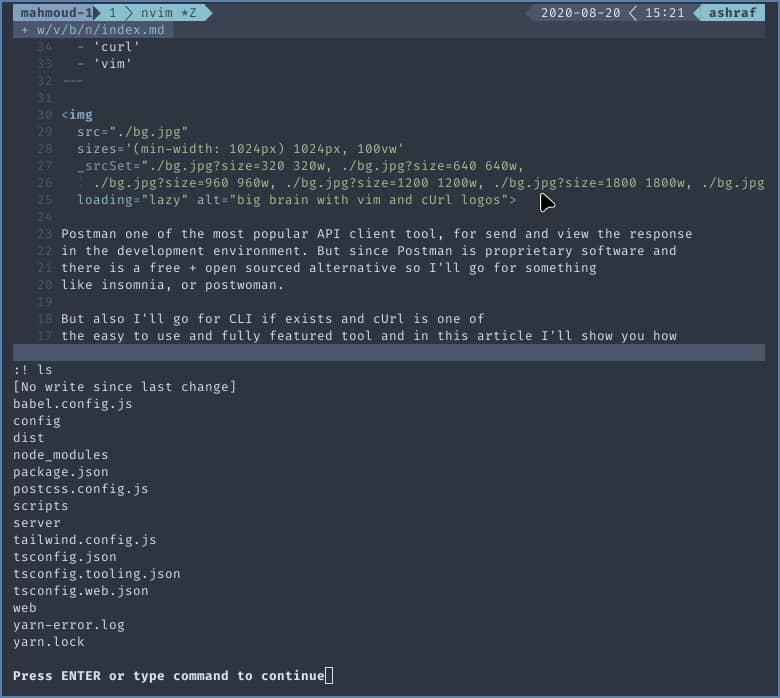
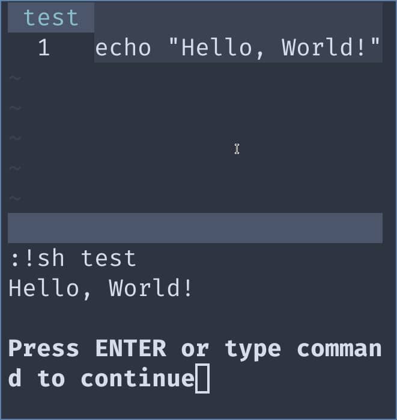
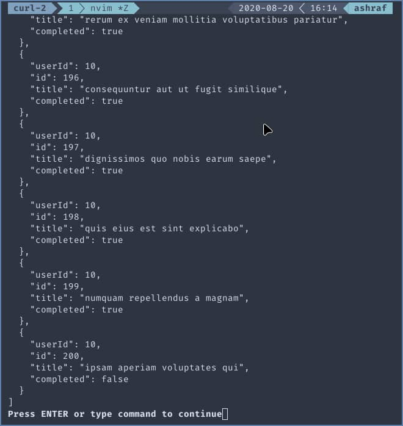
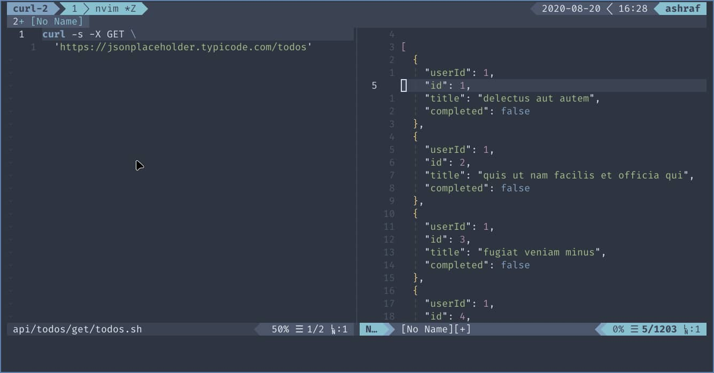

Postman one of the most popular API client tool, for send and view the response
in the development environment. But since Postman is proprietary software and
there is a free + open sourced alternative so I'll go for something
like insomnia, or postwoman.

But also I'll go for CLI if exists and cURL is one of
the easy to use and fully featured tool and in this article I'll show you how
to setup a well-documented api with cURL + vim + git.

## How to execute CLI inside your vim editor?

vim is very powerful editor and you can execute an command line
inside it. go to command mode and insert `:! <command>` and hit enter.

for example:

```vim
  :! ls
```

will execute the `ls` command line and show the content
in pager.



## Execute the content of the current file as CLI.

open an empty file inside your vim and write inside it `echo Hello, World!` and save it,
and then write `:!sh %`.

The percent `%` is refer to the filename so if we run it with normal bang `:! %`
it will not work because it's trying run the file as executable file not the content inside.

so we pass `sh` before the `%` to run the content inside the file via shell.



## Test our first cURL command

for demonstrating we will gonna use [jsonplaceholder](https://jsonplaceholder.typicode.com/) as our API to test

Now create a folder structure like below:

```bash
└── api
    └── todos
        ├── delete
        │   └── todo.zsh
        ├── get
        │   ├── todo-by-user.sh
        │   ├── todo.sh
        │   └── todos.sh
        ├── patch
        │   └── todo.sh
        ├── post
        │   └── todo.sh
        └── put
            └── todo.sh
```

`.sh` to get file highlighted.

let's start with first and simple one `api/posts/get/todos.sh`.

write in the file and save.

```bash
curl -s -X GET \
	'https://jsonplaceholder.typicode.com/todos'
```

then as we done before run `:!sh %`



# Make the result More Handy.

In most tools you will get a split view for the request itself
and the result.

open you vim config file and add

```vim
command Exec set splitright | vnew | set filetype=sh | read !sh #
```

the command before will open the result in a new buffer in vertical view.

if you prefer horizontal view you can change the command to

```vim
command Exec set splitbelow | new | set filetype=sh | read !sh #
```

open again `api/posts/get/todos.sh` and in command mode write `:Exec`
that will execute the command inside the file and open split view with the result.



now you have vim buffer you can easily search and do whatever you do. and to close the buffer you can use
command `:bd!` or the keyboard shortcut `shift + z + q`.

## Is cURL limited?

The answer is **NO**.
let's see couple of example

- POST Request:

```bash
curl -s -X POST \
	'https://jsonplaceholder.typicode.com/posts' \
	-H 'Content-Type: application/json' \
	-d '{ "title": "fooBatch", "completed": false, "userId": 1 }' \
```

you can make post, get, put, .. or any http request by using `-X <REQUEST_TYPE>` option.

To pass the body data use `-d, --data {json format>}` , and if the data is large
you can write it in `json` file and pass it as `-d @todo.json`

- GET Request with query params:

```bash
curl -s -X GET -G \
	'https://jsonplaceholder.typicode.com/todos' \
	-d 'userId=1'
```

you can still use query params with `-d` but add an additional `-G, --get` to pass it as query params

since this is not a cURL tutorial that's will be enough and you
can learn more about advanced stuff like set header, cookie and more from the internet.

## Using git?

Of course, on our created directory run `git init` and push for example to github.

[see this example on github](https://github.com/22mahmoud/vim-curl-demo)

## Conclusion

You can now write a well-documented api and share it with your team via git
all that done with simple and open-sourced tools and that's not limited to cURL
you can write your own scripts and run it inside vim, or pipe your cURL command for other
tools to manipulate the output for example `jq` so you can filter your output.
