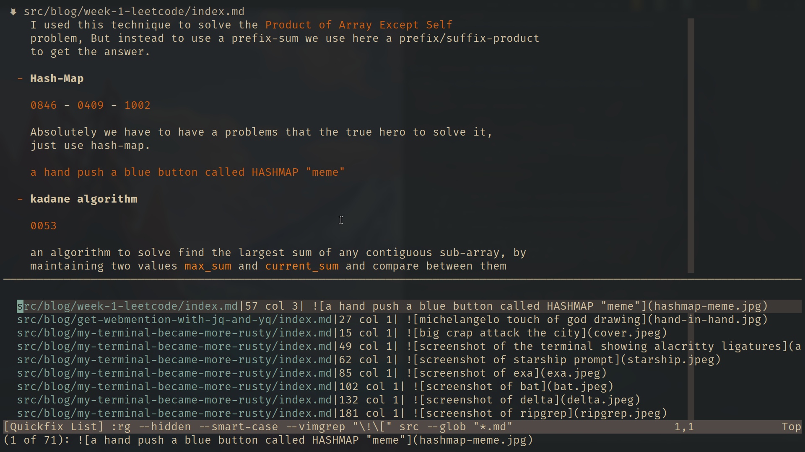

I'm using pandoc to generate this website from markdown files to html, and the
problem that all my images are converted into `<figure>` tags with
`<figcaption>`, but my goal is to just generate a normal `img` tag with `alt`
attribute, and to solve this issue I need to convert all my image formats from

```md

<!-- to be  -->
\](\(.*\))/
```


1. `<.'>` This indicates the code range to apply the command only for the current
   visually selected and for this case I select the entire line with `shift+v`.
1. `s/` this the shorthand for `:substitute`
   ```
   s/<pattern-to-find>/<change-with>
   ```
1. `\!\[\(.*\)\](\(.*\))`
    - escape all special characters `!` `[` `]` by adding backslash `\` before each
    of them
    - define a group to capture all text inside the square brackets `[]` by
    using `\(.*\)`
    - the define another group to capture the path inside `()` by using the
    `\(.*\)`
1. `` now we change the entire line with our format and
    - `\2` refers to the second capture group which is the path `path.jpg`
    - `\1` refers to the first capture group which is the title `"title"`


## Search for all image occurrences

Now after we know our command to change the image format, we need to search for
all image occurrences in `markdown` files in the `src` directory.

So, we can use vim `grep` command like that

> **_NOTE:_**  I'm using neovim  v0.11 which is use `ripgrep` by default. So,
> maybe some arguments here will not work with normal grep

```vim
:silent grep "\!\[" src --glob "*.md"
```



Now we have all our results inside the `quickfix` list, we can use
`:c[next|prev]` command to cycle between the list and apply our command for each
one, but that will be executed and non-efficient.

## Apply the command for quickfix list

Fortunately, that vim has a built-in feature to apply any command to all files
inside the `qucikfix` list by using `:cdo` command, so here is the command will
be:

```vim
:silent cdo! s/\!\[\(.*\)\](\(.*\))//g
```

We add `/g` as well to apply the command in all files. Also if you need
manually confirm for each substitute you add `/gc`.


## Finally save the files

So after everything is good we need to save every change by using

```vim
:wa!
```
