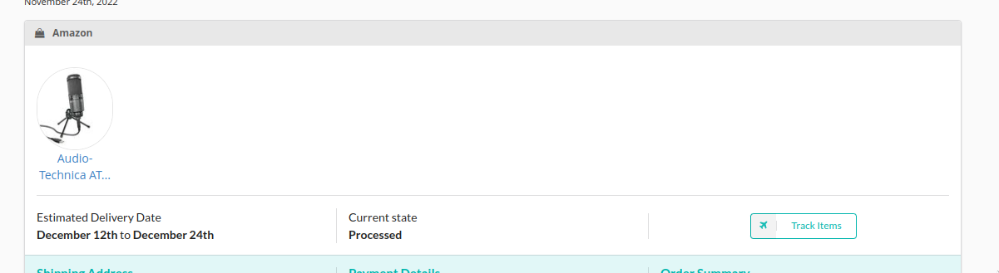
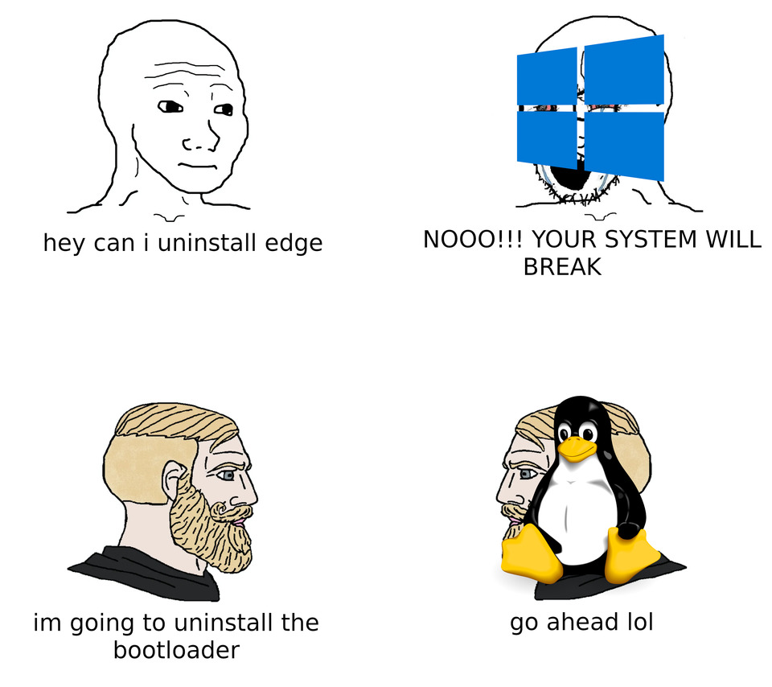
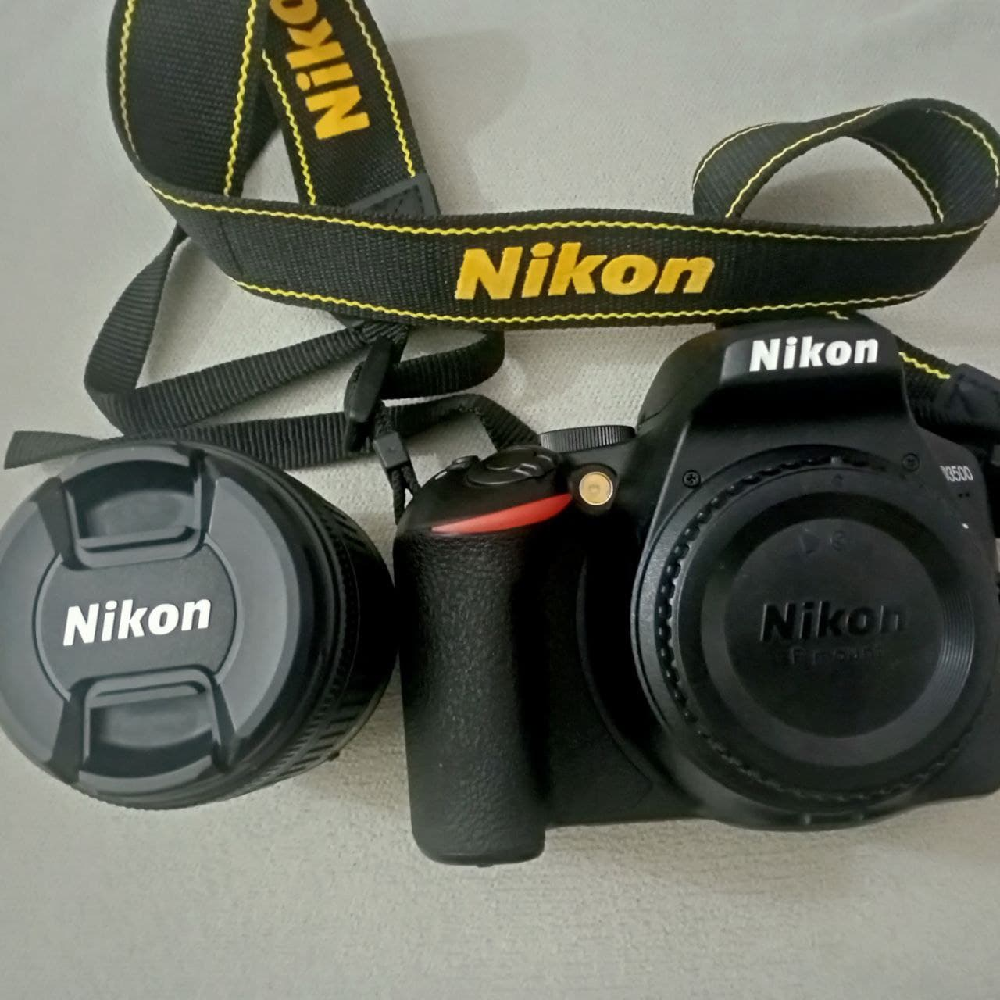
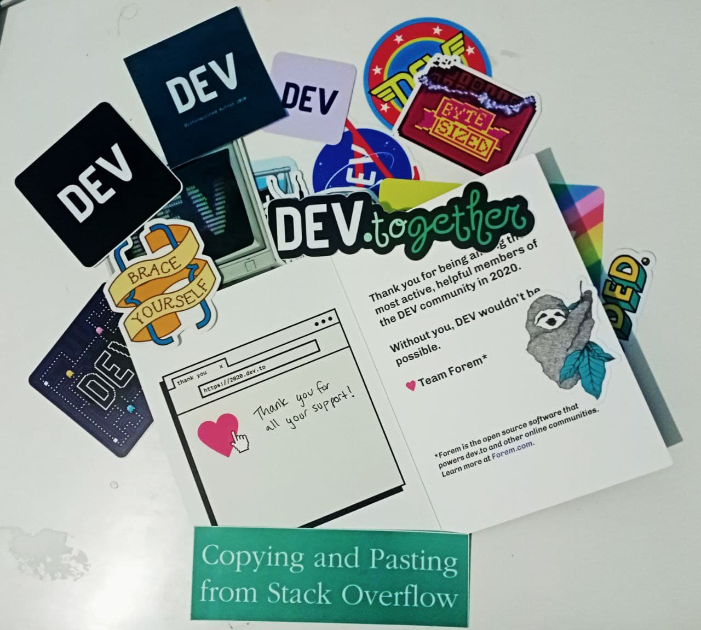
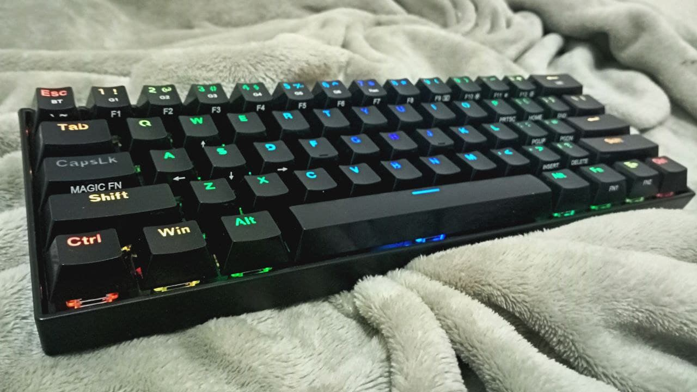

# Thoughts

- [[2022-11-24T21:16+02:00](/thoughts/1669317382)]
في الطريق

___

- [[2021-08-17T13:50+02:00](/thoughts/1634330500)]

___

- [[2021-08-17T13:50+02:00](/thoughts/1629201049)]
update: I closed my linkedin account

___

- [[2021-07-18T20:23+02:00](/thoughts/1626632598)]
Let's take some great photos!! 📷
My first DSLR camera Nikon D3500

___

- [[2021-05-16T05:20+02:00](/thoughts/1621135238)]
Monad, Functor, Semigroup, and Task ... new vocab for me while learning
functional programming.

___

- [[2021-03-20T16:38+02:00](/thoughts/1616251095)]
Best Recipes site with no ads, no javascript 
[Based cooking](https://based.cooking/)

___

- [[2021-02-17T03:20+02:00](/thoughts/1613524846)]
Finally, received my gift from [dev.to](https://dev.to)
Thanks [@ThePracticalDev](https://twitter.com/ThePracticalDev)

___

- [[2021-01-12T23:46+02:00](/thoughts/1610488005)]
I got a new mechanical keyboard today, yaaay 🎊🎊
Redragon k530

___

- [[2020-12-14T23:19+02:00](/thoughts/1607980789)]
It's the perfect time to start get google away from your life. #degoogle

___

- [[2020-12-11T17:50+02:00](/thoughts/1607701838)]
"There are only two industries that call their customers ‘users’: 
illegal drugs and software"  
\- Edward Tufte

___

- [[2020-12-08T20:06+02:00](/thoughts/1607450816)]
After 7 years since this [Issue](https://github.com/isaacs/github/issues/66) 
created, now github has a dark mode ❤.
<video controls>
  <source src="1607450816/github-dark.mp4" type="video/mp4">
</video>

___

- [[2020-12-06T18:36+02:00](/thoughts/1607272609)]
My blog now become more privacy friendly I removed the analytics and just
write in the void.

___

- [[2020-10-27T17:48+02:00](/thoughts/1603813689)]
using [suckless](https://suckless.org) programmes gives you a nice opportunity
to learn `c` programming language.

___

- [[2020-10-24T13:03+02:00](/thoughts/1603537430)]
The best thing about OpenBSD: artwork and songs.

___

- [[2020-10-07T12:04+02:00](/thoughts/1602065053)]
This day is crowded by REJECTION emails 😅

___

- [[2020-10-02T21:23+02:00](/thoughts/1601666637)]
I'm building a virtual evevnt platform and really webrtc concepts
is very hard for me and the content on the internet not up-to-date.

___

- [[2020-09-23T08:14+02:00](/thoughts/1600841685)]
I migrated my nvim-coc setup to native neovim lsp using nvim-lspconfig with completion-nvim.

___

- [[2020-09-20T00:42+02:00](/thoughts/1600555336)]
let's play with vue 3 and give it a new try. actually I'm not big fan of vue but the one-piece version is very
promising.

___

- [[2020-09-19T13:29+02:00](/thoughts/1600514947)]
I just got my free ticket to #nextjsconf!

___

- [[2020-09-19T11:09+02:00](/thoughts/1600506588)]
انك يبقي عندك المدونة بتاعتك اللي تقدر تحط عليها افكارك و وتدويناتك بيخليك تكون المالك الحصري للمحتوي بتاعك احسن بكتير لما يكون افكارك متوزعة علي مواقع التواصل الاجتامعي اللي ممكن فى اي لحظة تقفل ومتقدرش توصل لمحتواك.  

___

- [[2020-09-19T05:36:34.000Z](/thoughts/1600493794)]
I'm using [turblinks](https://github.com/turbolinks/turbolinks) with my eleventy blog gives me a very nice looking navigation that simulate SPA behaviour. 
