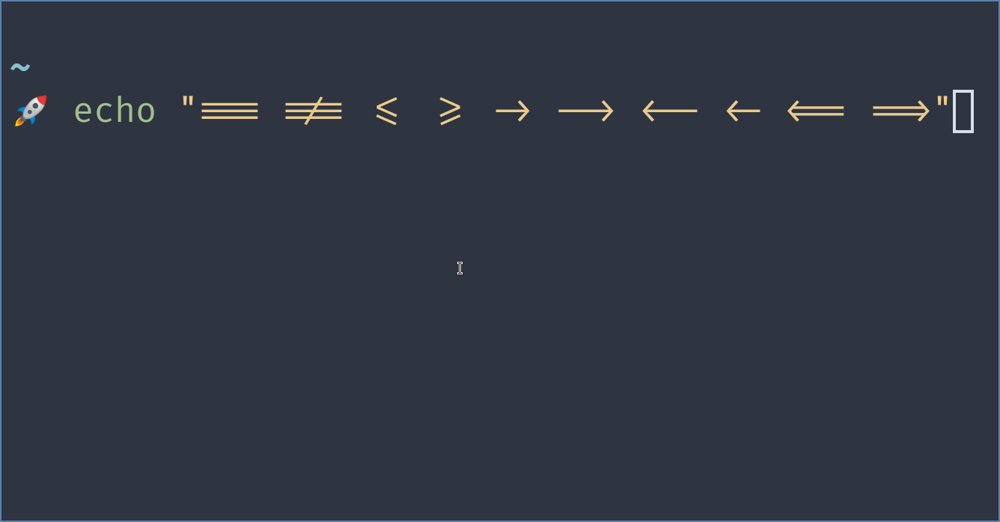
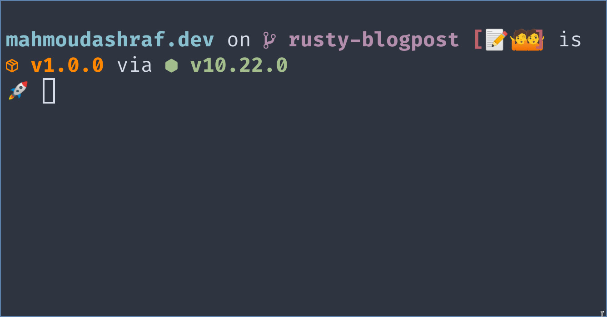
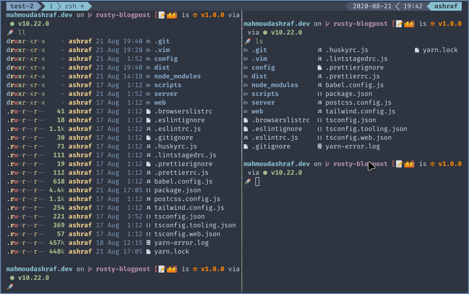
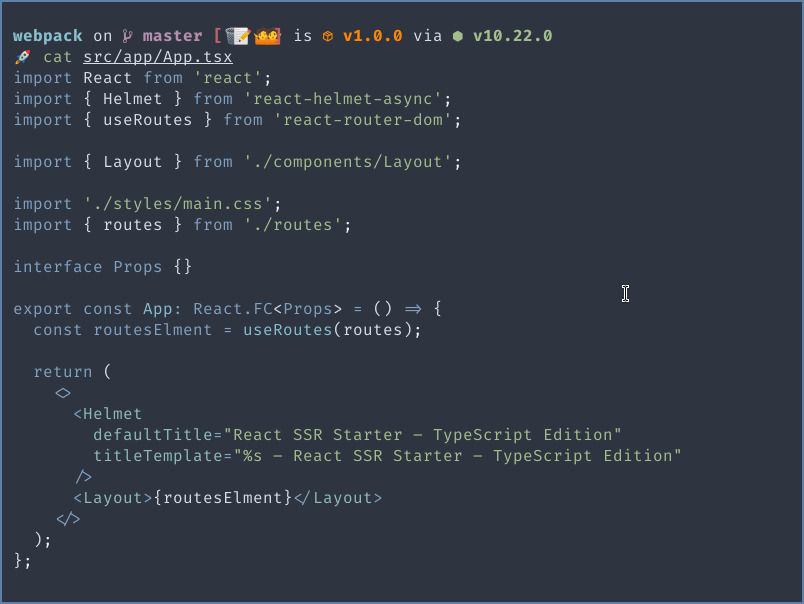
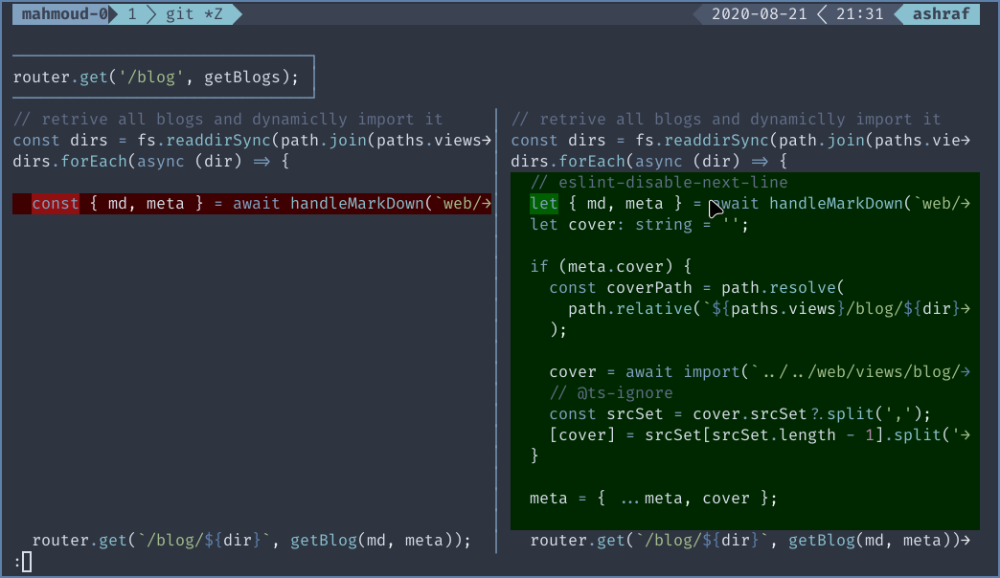
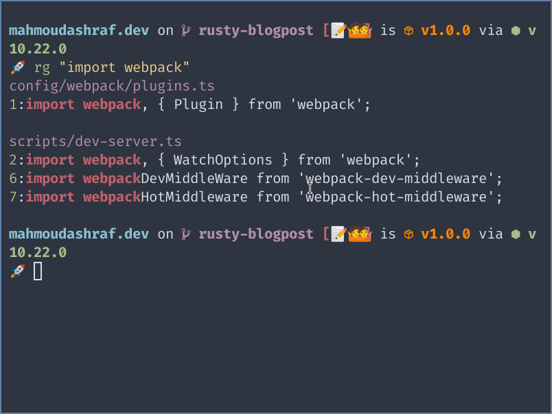
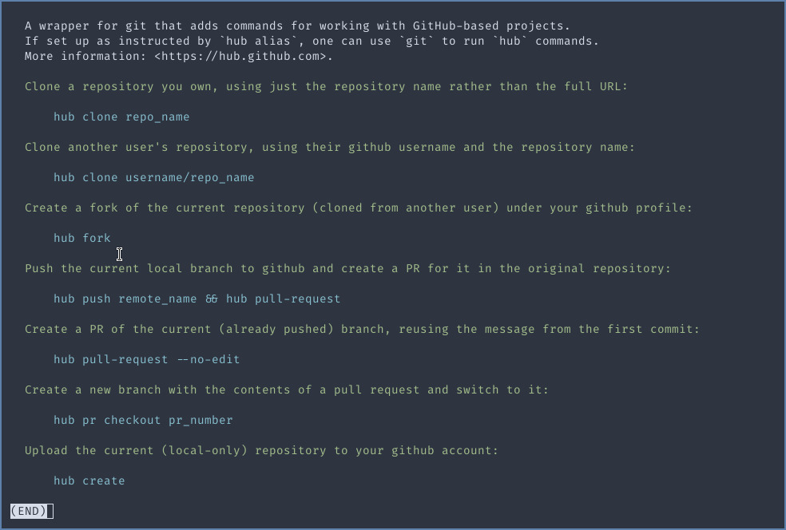

As a Software-Engineer I spent most of the time inside my terminal, So
I need for that a fast terminal with  fast tools to speed up my productivity.

The tools written in rust help me to achieve that. let's see in this article
those tools.

[//]: # "/* cspell:disable */"
> ### tl;dr
> - [alacritty](https://github.com/alacritty/alacritty)  A cross-platform, GPU-accelerated terminal emulator
> - [starship](https://github.com/starship/starship) 🌌 The minimal, blazing-fast, and infinitely customizable prompt for any shell!
> - [exa](https://github.com/ogham/exa) A modern version of ‘ls’.
> - [bat](https://github.com/sharkdp/bat) A cat(1) clone with wings.
> - [delta](https://github.com/dandavison/delta) A viewer for git and diff output
> - [zoxide](https://github.com/ajeetdsouza/zoxide) A faster way to navigate your filesystem
> - [ripgrep](https://github.com/burntsushi/ripgrep) ripgrep recursively searches directories for a regex pattern
> - [fd](https://github.com/sharkdp/fd) A simple, fast and user-friendly alternative to 'find'
> - [bottom](https://github.com/clementtsang/bottom) Yet another cross-platform graphical process/system monitor.
> - [tldr](https://github.com/tldr-pages/tldr) 📚 Collaborative cheatsheets for console commands
> - [spotify-tui](https://github.com/rigellute/spotify-tui) Spotify for the terminal written in Rust 🚀
> - [gitui](https://github.com/extrawurst/gitui) Blazing 💥 fast terminal-ui for git written in rust 🦀
[//]: # "/* cspell:enable */"

### Alacritty

Let's start our list with alacritty terminal is one of the fastest terminals 
because of using GPU for rendering, and it is a cross-platform terminal.

You can customize your own configuration like color scheme, fonts, opacity, and key mapping.

Alacritty doesn't come with ligature support but you can use 
this [fork](https://github.com/zenixls2/alacritty/tree/ligature). or if 
you are using Arch you can install it from [aur](https://aur.archlinux.org/packages/alacritty-ligatures/)



---

### Starship

I used to use zsh + powerlevel9k as my prompt and even when I migrate to powerlevel10k, I still
notice a delay when open new shell. But with starship it's start instantly.

You can use it with any shell bash, zsh, fish and even powerShell.

The screenshot below showing the result of my customized configuration.



---

### Exa

exa is an implementation of `ls` command but with colors and icons and it renders very fast.

I'm using exa as replacer for ls command by making an alias.

```sh
if [ "$(command -v exa)" ]; then
    unalias -m 'll'
    unalias -m 'l'
    unalias -m 'la'
    unalias -m 'ls'
    alias ls='exa -G  --color auto --icons -a -s type'
    alias ll='exa -l --color always --icons -a -s type'
fi
```

the result of my `ls` and `ll` commands.



---

### Bat

Bat is an implementation for `cat` command but with syntax highlighted.

Also I make an alias for this command with nord theme.

```sh
if [ "$(command -v bat)" ]; then
  unalias -m 'cat'
  alias cat='bat -pp --theme="Nord"'
fi
```



---

### Delta

delta enhance your git diff output by adding some cool features like syntax highlighting,
line numbering, and side-by-side view.

to make delta works in your `.gitconfig` file add:

```yaml
[core]
  pager = delta
[interactive]
  diffFilter = delta --color-only
[delta]
  side-by-side = true
  line-numbers-left-format = ""
  line-numbers-right-format = "│ "
  syntax-theme = Nord
```

we set `delta` as the default pager for git commands output and enable side-by-side 
feature and set a theme for Nord, You can choose your preferred theme  run and choose one.

```sh
delta --list-syntax-themes
```



---

### Zoxide

I don't use any file explorer, I just use `cd` command to navigate between the files and `ls` commands.

I have a `projects` directory on my home folder if I wanna navigate to a project of those projects.
I will write

```sh
cd ~/projects/mahmoudashraf.dev
```

instead I will write 

```sh
z ~/projects/mahmoudashraf.dev
```

just to the first time and if I wanna navigate again to this directory from anywhere
just write 

```sh
z mah
```

---

### Ripgrep

It is a  cross-platform command line searches your directory for a regex pattern. 

I recommend you read this article [ripgrep is faster than {grep, ag, git grep, ucg, pt, sift}
](https://blog.burntsushi.net/ripgrep/).

some commands that i'm using

```sh
# search on javascript files for specific regex
rg tjs "import React"

rg "\.content" -g "*.pug"

# you can also search and replace with regex as sed command
rg fast README.md --replace FAST
```


---

### Fd

the friendly version of `find` command, and faster.

It's by default ignore `.gitignore` file

in this tutorial I have some screenshots in `png` format to convert them all to `jpg`:

```sh
fd -e png -x convert {} {.}.jpg
```

To delete files

```sh
fd -H '^\.DS_Store$' -tf -X rm
```

---

### bottom

In this time not `top` 😀 it is `bottom`

it's a cross-platform system monitor. 


---


### Tldr

tldr is a cheatsheets for CLIs, instead of read the whole `man`.



---

### More Tools?

- for who want lightweight alternative for github client you can use `spotify-tui`.
- also if you prefer an UI interface  for git check `gitui`.

and there is a ton of CLIs and tools written in rust you can check 
[lib.rs/command-line-utilities](https://lib.rs/command-line-utilities)


